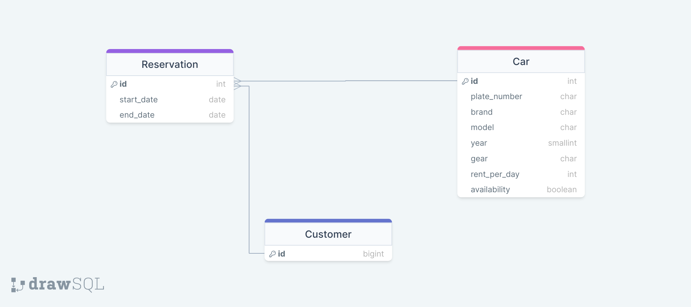

<h1> Django Projects</h1>

Clarusway

 

# Rent a Car App

Rent a car app enables customers to rent autos between start and end date of their reservation.

## ERD

 
     

## BackEnd Tasks

- Customers;
  - can select start and end date and see the list of available cars on selected dates. It is not allowed to choose past dates.
  - can choose a car on the list and reserve that car, but can not reserve more than one car on a selected time period,
  - can not reserve cars which are reserved by other customers on selected time period.
  - can see the list of their reservations including past ones.
  - can update reservations.
  - can delete their reservations.

- Admins;
  - can make CRUD operations on Car table,
  - can make CRUD operations on Customers table,
  - can make CRUD operations on Reservations table,

- There will be filtering, pagination, and sorting capabilities on list views.

---

##  Araç Kiralama Projesi

* Müşteriler:
  * Tarih aralığı belirtip müsait araç listeleyebilir. Geçmiş tarihler listelenmez.
  * Seçilen tarih aralığında araç rezerve edilebilir, ancak aynı tarih aralığında ikinci bir araç kiralayamaz.
  * Rezerve edilmiş bir aracı, o tarihlerde rezerve edemez.
  * Rezervasyonlarını listeyebilir.
  * Rezervasyonlarını silebilir.
* Yöneticiler:
  * Araba tablosu CRUD işlemleri
  * Müşteri (Kullanıcı) tablosu CRUD işlemleri
  * Reservasyon tablosu CRUD işlemleri

* Listeleme ekranlarında filtreleme, sayfalama, sıralama imkanları olacaktır.

---

**
&#9786; Happy Coding! &#9997;
**

Clarusway

